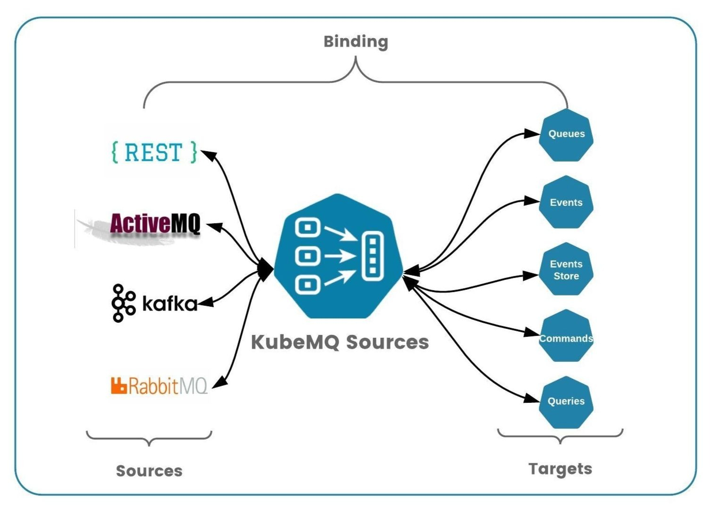

# KubeMQ Sources

KubeMQ Sources connects external systems and cloud services with KubeMQ message queue broker.

KubeMQ Sources allows us to build a message-based microservices architecture on Kubernetes with minimal efforts and without developing connectivity interfaces between external system such as messaging components (RabbitMQ, Kafka, MQTT) ,REST APIs and KubeMQ message queue broker.
In addition, KubeMQ Sources allows migrating legacy systems (together with [KubeMQ Targets](https://github.com/kubemq-hub/kubemq-targets)) to KubeMQ based messaging architecture.


**Key Features**:

- **Runs anywhere**  - Kubernetes, Cloud, on-prem, anywhere
- **Stand-alone** - small docker container / binary
- **Single Interface** - One interface all the services
- **API Gateway** - Act as an REST Api gateway
- **Plug-in Architecture** Easy to extend, easy to connect
- **Middleware Supports** - Logs, Metrics, Retries, and Rate Limiters
- **Easy Configuration** - simple yaml file builds your topology

## Concepts

KubeMQ Sources building blocks are:
 - Binding
 - Source
 - Target

### Binding

Binding is a 1:1 connection between Source and Target. Every Binding runs independently.



### Source

Source is an external service that provide ingress data to KubeMQ's channels which then later consumed by services connected to KubeMQ server.

Source can be services such HTTP REST Api, Messaging systems (RabbitMQ, Kafka, MQTT etc).

KubeMQ Sources integrate each one of the supported sources and ingest data into KubeMQ via Targets.

A list of supported sources is below.

#### Standalone Services

| Category  | Target                                                    | Kind                      | Configuration                       | Example                                |
|:----------|:----------------------------------------------------------|:--------------------------|:------------------------------------|:---------------------------------------|
| Http      | Http                                                      | http                      | [Usage](sources/http)               | [Example](examples/http)               |
| Messaging |                                                           |                           |                                     |                                        |
|           | [Kafka](https://kafka.apache.org/)                        | messaging.kafka           | [Usage](sources/messaging/kafka)    | [Example](examples/messaging/kafka)    |
|           | [RabbitMQ](https://www.rabbitmq.com/)                     | messaging.rabbitmq        | [Usage](sources/messaging/rabbitmq) | [Example](examples/messaging/rabbitmq) |
|           | [MQTT](http://mqtt.org/)                                  | messaging.mqtt            | [Usage](sources/messaging/mqtt)     | [Example](examples/messaging/mqtt)     |
|           | [ActiveMQ](http://activemq.apache.org/)                   | messaging.activemq        | [Usage](sources/messaging/activemq) | [Example](examples/messaging/activemq) |
|           | [IBM-MQ](https://developer.ibm.com/components/ibm-mq)     | messaging.ibmmq           | [Usage](sources/messaging/ibmmq)    | [Example](examples/messaging/ibmmq)  |
|           | [Nats](https://nats.io/)                                 |messaging.nats  | [Usage](sources/messaging/nats)     | [Example](examples/messaging/nats)     |
| Storage    |                                                                     |                       |                                      |                                         |
|            | Filesystem                                                          | storage.filesystem    | [Usage](sources/storage/filesystem)  |                                         |

#### Google Cloud Platform (GCP)

| Category  | Target                                      | Kind                      | Configuration                       | Example                                |
|:----------|:--------------------------------------------|:--------------------------|:------------------------------------|:---------------------------------------|
| Messaging | [Pub/Sub](https://cloud.google.com/pubsub)  | gcp.pubsub                | [Usage](sources/gcp/pubsub)         | [Example](examples/gcp/pubsub)               |

#### Amazon Web Service (AWS)


| Category   | Target                                                         | Kind                       | Configuration                              | Example                                       |
|:-----------|:---------------------------------------------------------------|:---------------------------|:-------------------------------------------|:----------------------------------------------|
| Messaging  |                                                                |                                 |                                         |                                            |
|            | [AmazonMQ](https://aws.amazon.com/amazon-mq/)                  |aws.amazonmq                     | [Usage](sources/aws/amazonmq)           | [Example](examples/aws/amazonmq)           |
|            | [msk](https://aws.amazon.com/msk/)                             |aws.msk                          | [Usage](sources/aws/msk)                | [Example](examples/aws/msk)                |
|            | [SQS](https://aws.amazon.com/sqs/)                             |aws.sqs                          | [Usage](sources/aws/sqs)                | [Example](examples/aws/sqs)                |

#### Microsoft Azure

| Category   | Target                                                                | Kind                       | Configuration                              | Example                                       |
|:-----------|:----------------------------------------------------------------------|:---------------------------|:-------------------------------------------|:----------------------------------------------|
| EventHubs  |                                                                       |                            |                                        |                                          |
|            | [EventHubs](https://azure.microsoft.com/en-us/services/event-hubs/)   |azure.eventhubs             | [Usage](sources/azure/eventhubs)       | [Example](examples/azure/eventhubs)      |
| ServiceBus |                                                                       |                            |                                        |                                          |
|            | [ServiceBus](https://azure.microsoft.com/en-us/services/service-bus/) |azure.servicebus            | [Usage](sources/azure/servicebus)      | [Example](examples/azure/servicebus)     |

### Target

The target is a KubeMQ connection which send the data from the sources and route them to the appropriate KubeMQ channel for action, and return back a response if needed.

KubeMQ Sources supports all of KubeMQ's messaging patterns: Queue, Events, Events-Store, Command, and Query.


| Type                                                                              | Kind                |  Message Pattern  | Configuration                           |
|:----------------------------------------------------------------------------------|:--------------------|:---|:----------------------------------------|
| [Queue](https://docs.kubemq.io/learn/message-patterns/queue)                      | kubemq.queue        |  Queue  | [Usage](targets/queue/README.md)        |
| [Events](https://docs.kubemq.io/learn/message-patterns/pubsub#events)             | kubemq.events       |  Pub/Sub  | [Usage](targets/events/README.md)       |
| [Events Store](https://docs.kubemq.io/learn/message-patterns/pubsub#events-store) | kubemq.events-store |  Pub/Sub  | [Usage](targets/events-store/README.md) |
| [Command](https://docs.kubemq.io/learn/message-patterns/rpc#commands)             | kubemq.command      |  RPC  | [Usage](targets/command/README.md)      |
| [Query](https://docs.kubemq.io/learn/message-patterns/rpc#queries)                | kubemq.query        |  RPC  | [Usage](targets/query/README.md)        |

## Installation

### Kubernetes

1. Install KubeMQ Cluster

```bash
kubectl apply -f https://get.kubemq.io/deploy
```

2. Run KubeMQ Source deployment yaml

```bash
kubectl apply -f https://raw.githubusercontent.com/kubemq-hub/kubemq-sources/master/deploy-example.yaml
```

### Binary (Cross-platform)

Download the appropriate version for your platform from KubeMQ Sources Releases. Once downloaded, the binary can be run from anywhere.

Ideally, you should install it somewhere in your PATH for easy use. /usr/local/bin is the most probable location.

Running KubeMQ Sources

```bash
./kubemq-sources --config config.yaml
```

### Windows Service

1. Download the Windows version from KubeMQ Sources Releases. Once downloaded, the binary can be installed from anywhere.
2. Create config.yaml configuration file and save it to the same location of the Windows binary.


#### Service Installation

Run:
```bash
kubemq-sources.exe --service install
```

#### Service Installation With Username and Password

Run:
```bash
kubemq-sources.exe --service install --username {your-username} --password {your-password}
```

#### Service UnInstall

Run:
```bash
kubemq-sources.exe --service uninstall
```

#### Service Start

Run:
```bash
kubemq-sources.exe --service start
```


#### Service Stop

Run:
```bash
kubemq-sources.exe --service stop
```

#### Service Restart

Run:
```bash
kubemq-sources.exe --service restart
```

**NOTE**: When running under Windows service, all logs will be emitted to Windows Events Logs.


## Configuration

### Build Wizard

KubeMQ Bridges configuration can be build with Build and Deploy tool [https://build.kubemq.io/#/sources](https://build.kubemq.io/#/sources)


### Structure

Config file structure:

```yaml

apiPort: 8083 # kubemq sources api and health end-point port
bindings:
  - name: clusters-sources # unique binding name
    properties: # Bindings properties such middleware configurations
      log_level: error
      retry_attempts: 3
      retry_delay_milliseconds: 1000
      retry_max_jitter_milliseconds: 100
      retry_delay_type: "back-off"
      rate_per_second: 100
    source:
      kind: http # source kind
      name: name-of-sources # source name 
      properties: # a set of key/value settings per each source kind
        .....
    target:
      kind: kubemq.events # target kind
      name: name-of-target # targets name
      properties: # a set of key/value settings per each target kind
        - .....
```

### Properties

In bindings configuration, KubeMQ Sources support properties setting for each pair of source and target bindings.

These properties contain middleware information settings as follows:

#### Logs Middleware

KubeMQ Sources support level based logging to console according to as follows:

| Property  | Description       | Possible Values        |
|:----------|:------------------|:-----------------------|
| log_level | log level setting | "debug","info","error" |
|           |                   |  "" - indicate no logging on this bindings |

An example for only error level log to console:

```yaml
bindings:
  - name: sample-binding 
    properties: 
      log_level: error
    source:
    ......  
```

#### Retry Middleware

KubeMQ Sources support Retries' target execution before reporting of error back to the source on failed execution.

Retry middleware settings values:


| Property                      | Description                                           | Possible Values                             |
|:------------------------------|:------------------------------------------------------|:--------------------------------------------|
| retry_attempts                | how many retries before giving up on target execution | default - 1, or any int number              |
| retry_delay_milliseconds      | how long to wait between retries in milliseconds      | default - 100ms or any int number           |
| retry_max_jitter_milliseconds | max delay jitter between retries                      | default - 100ms or any int number           |
| retry_delay_type              | type of retry delay                                   | "back-off" - delay increase on each attempt |
|                               |                                                       | "fixed" - fixed time delay                  |
|                               |                                                       | "random" - random time delay                |

An example for 3 retries with back-off strategy:

```yaml
bindings:
  - name: sample-binding 
    properties: 
      retry_attempts: 3
      retry_delay_milliseconds: 1000
      retry_max_jitter_milliseconds: 100
      retry_delay_type: "back-off"
    source:
    ......  
```

#### Rate Limiter Middleware

KubeMQ Sources support a Rate Limiting of target executions.

Rate Limiter middleware settings values:


| Property        | Description                                    | Possible Values                |
|:----------------|:-----------------------------------------------|:-------------------------------|
| rate_per_second | how many executions per second will be allowed | 0 - no limitation              |
|                 |                                                | 1 - n integer times per second |

An example for 100 executions per second:

```yaml
bindings:
  - name: sample-binding 
    properties: 
      rate_per_second: 100
    source:
    ......  
```


